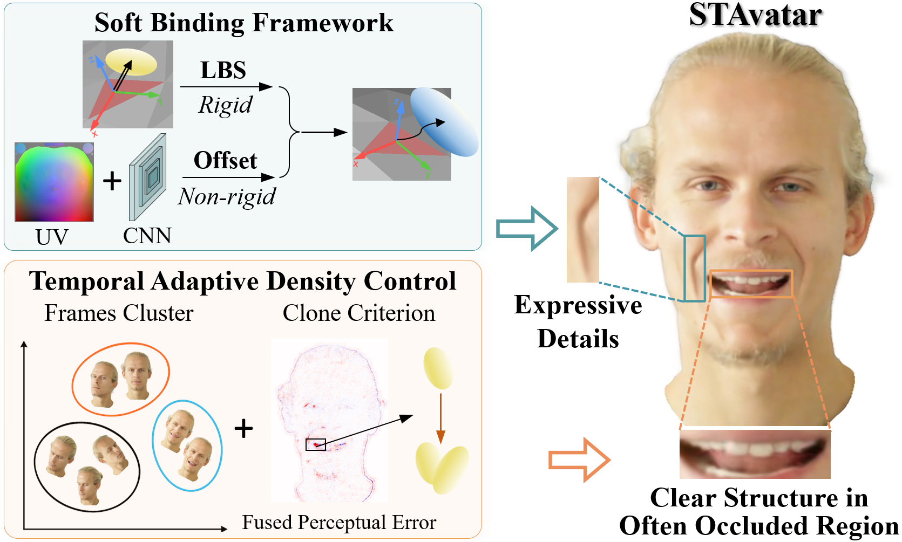

# STAvatar
Official repository for the paper

**STAvatar: Soft Binding and Temporal Density Control for Monocular 3D Head Avatars Reconstruction**

Jiankuo Zhao</a><sup>1,2</sup>, <a href="https://xiangyuzhu-open.github.io/homepage/" target="_blank">Xiangyu Zhu</a><sup>1,2</sup>, Zidu Wang</a><sup>1,2</sup>, <a href="http://www.cbsr.ia.ac.cn/users/zlei/" target="_blank">Zhen Lei</a><sup>1,2,3</sup>

<sup>1</sup>Institute of Automation, Chinese Academy of Sciences, <sup>2</sup>School of Artificial Intelligence, University of Chinese Academy of Sciences, <sup>3</sup>Centre for Artificial Intelligence and Robotics, Hong Kong Institute of Science \& Innovation,Chinese Academy of Sciences

<a href='https://arxiv.org/abs/2511.19854'></a> <a href='https://lcfaw.github.io/STAvatar/'></a> 

<!-- <a href='#citation'></a> -->



## Pipeline

In this paper, we present STAvatar, a novel method for high-fidelity and training-efficient reconstruction of animated avatars from monocular videos. The proposed UV-Adaptive Soft Binding framework enables flexible and non-rigid deformation field modeling while remaining compatible with the Adaptive Density Control (ADC), thereby effectively capturing subtle expressions and fine-grained details. Besides, our Temporal ADC strategy addresses the limitations of vanilla ADC in dynamic avatar reconstruction, resulting in more accurate and complete reconstructions in frequently occluded regions. Extensive experiments demonstrate that our method significantly outperforms previous approaches in both reconstruction quality and training efficiency.


## Code
Code will be coming soon!

## Cite
```
@article{zhao2025stavatar,
  title={STAvatar: Soft Binding and Temporal Density Control for Monocular 3D Head Avatars Reconstruction},
  author={Zhao, Jiankuo and Zhu, Xiangyu and Wang, Zidu and Lei, Zhen},
  journal={arXiv preprint arXiv:2511.19854},
  year={2025}
}
```