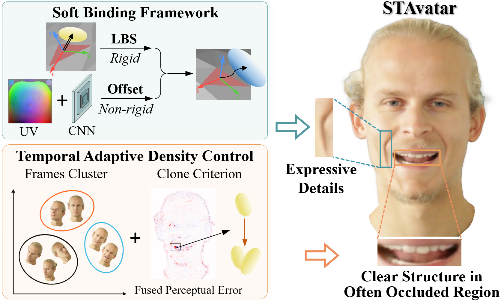
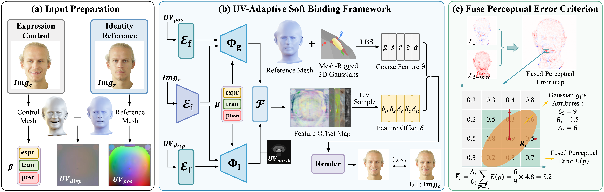

# STAvatar
Official repository for the paper

**STAvatar: Soft Binding and Temporal Density Control for Monocular 3D Head Avatars Reconstruction**

Jiankuo Zhao</a><sup>1,2</sup>, <a href="https://xiangyuzhu-open.github.io/homepage/" target="_blank">Xiangyu Zhu</a><sup>1,2</sup>, Zidu Wang</a><sup>1,2</sup>, <a href="http://www.cbsr.ia.ac.cn/users/zlei/" target="_blank">Zhen Lei</a><sup>1,2,3</sup>

<sup>1</sup>Institute of Automation, Chinese Academy of Sciences, <sup>2</sup>School of Artificial Intelligence, University of Chinese Academy of Sciences, <sup>3</sup>Centre for Artificial Intelligence and Robotics, Hong Kong Institute of Science \& Innovation,Chinese Academy of Sciences

<a href='https://arxiv.org/abs/2511.19854'></a> <a href='https://jiankuozhao.github.io/STAvatar/'></a> 



## Pipeline
In this paper, we present STAvatar, a novel method for high-fidelity and training-efficient reconstruction of animated avatars from monocular videos. The proposed UV-Adaptive Soft Binding framework enables flexible and non-rigid deformation field modeling while remaining compatible with the Adaptive Density Control (ADC), thereby effectively capturing subtle expressions and fine-grained details. Besides, our Temporal ADC strategy addresses the limitations of vanilla ADC in dynamic avatar reconstruction, resulting in more accurate and complete reconstructions in frequently occluded regions. Extensive experiments demonstrate that our method significantly outperforms previous approaches in both reconstruction quality and training efficiency.



## 🛠️ Setup
### Installation
Follow the commands below to set up a Conda environment and install the necessary dependencies:
```bash
# Clone the repo:
git clone https://github.com/JiankuoZhao/STAvatar.git --recursive
cd STAvatar

conda create -n stavatar python=3.10
conda activate stavatar

# Install CUDA and ninja for compilation
conda install -c "nvidia/label/cuda-11.7.1" cuda-toolkit ninja

# Setup paths (only for linux)
ln -s "$CONDA_PREFIX/lib" "$CONDA_PREFIX/lib64"  # to avoid error "/usr/bin/ld: cannot find -lcudart"
conda env config vars set CUDA_HOME=$CONDA_PREFIX  # for compilation

# conda install
conda install pytorch==2.0.1 torchvision==0.15.2 torchaudio==2.0.2 pytorch-cuda=11.7 -c pytorch -c nvidia
# or: pip install torch==2.0.1 torchvision==0.15.2 torchaudio==2.0.2

pip install -r requirements.txt

# Install submodules
# NOTE: We use a modified version of diff-gaussian-rasterization. 
# Please install the provided submodules to ensure consistent results.
pip install submodules/diff-gaussian-rasterization
pip install submodules/simple-knn
pip install submodules/fused-ssim
``` 

### Weights Preparation
Our framework and pre-processed data are built upon FLAME 2023. Please download [original assets](https://flame.is.tue.mpg.de/download.php) the official assets and place them in the following directory:

- FLAME 2023 (versions w/ jaw rotation) -> `flame_model/assets/flame/flame2023.pkl`
- FLAME Vertex Masks -> `flame_model/assets/flame/FLAME_masks.pkl`

### Models and Datasets
To facilitate a quick start, we provide pre-trained models and processed data for the following three identities:
- **Marcel**: From the [IMAvatar dataset](https://github.com/zhengyuf/IMavatar).
- **Nf_01**: From the [Nerface dataset](https://github.com/gafniguy/4D-Facial-Avatars).
- **Obama**: From the [INSTA dataset](https://github.com/Zielon/INSTA).

All resources are available for download via [Google Drive](https://drive.google.com/drive/folders/1gypuUi1TsWm6Gm6vdyf6S-fwlYnEkg1r?usp=sharing).


### Process your custom dataset
We utilize [VHAP](https://github.com/ShenhanQian/VHAP.git) for dataset pre-processing. If you wish to use your custom data, please ensure the directory structure adheres to the following format:
```
<dataset_root>
├── images/                  # Original input images
├── fg_masks/                # Foreground masks (optional; not required by our current pipeline)
├── flame_param/             # Per-frame FLAME parameters (.npz)
├── canonical_flame_param.npz # Canonical FLAME configuration
├── transforms_train.json    # Camera extrinsics/intrinsics for training
├── transforms_val.json      # Camera extrinsics/intrinsics for validation
└── transforms_test.json     # Camera extrinsics/intrinsics for testing
```

## 🚀 Training & Rendering
We provide a comprehensive set of scripts to facilitate training, inference, and evaluation.

* **Training**: Execute the training script to reconstruct a 3D head avatar from a monocular sequence:
```bash
python train.py -s /path/to/input/dataset -m /path/to/save/models
```  

* **Rendering**: Generate high-quality animations using a trained model:
```bash
# Note on Path Configuration: If you are using our provided pre-trained models, please ensure that the path information in cfg_args is updated accordingly to maintain correct directory mapping.
python render.py --skip_val --skip_train -m /path/to/save/models
```  

* **Cross Reenactment**: Transfer the motion/expression from a target sequence to a source subject:
```bash
python render.py  -m /path/to/source/subject/model   -t /path/to/target/subject/dataset
```  

* **Metrics Caculation**: Compute quantitative results (PSNR, SSIM, LPIPS) for the rendered results:
```bash
python render.py  -m /path/to/save/models
```  

## 📖 Cite
If you find our paper or code useful in your research, please cite with the following BibTeX entry:
```
@article{zhao2025stavatar,
  title={STAvatar: Soft Binding and Temporal Density Control for Monocular 3D Head Avatars Reconstruction},
  author={Zhao, Jiankuo and Zhu, Xiangyu and Wang, Zidu and Lei, Zhen},
  journal={arXiv preprint arXiv:2511.19854},
  year={2025}
}
```

## 🤝 Acknowledgements
This implementation is built upon several excellent open-source projects. We would like to express our gratitude to the authors for their pioneering work:

* [Gaussian Splatting](https://github.com/graphdeco-inria/gaussian-splatting.git)
* [GaussianAvatars](https://github.com/ShenhanQian/GaussianAvatars.git)
* [VHAP](https://github.com/ShenhanQian/VHAP.git)

We thank the researchers for making their code and models available to the community.
